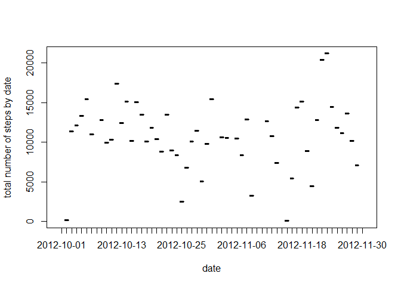
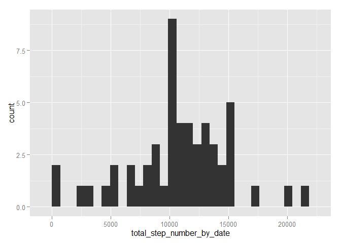
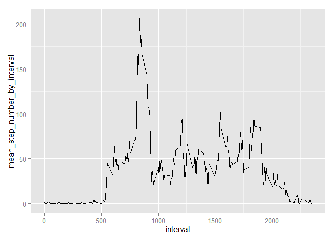
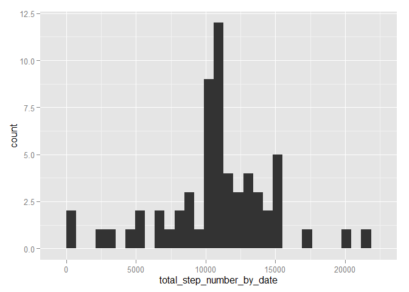
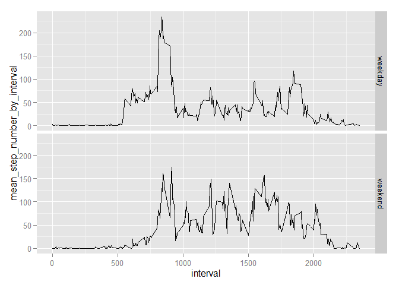

# Reproducible Research: Peer Assessment 1


## Loading and preprocessing the data

```r
setwd("C:/Dropbox/Coursera/5ReproducibleResearch/RepData_PeerAssessment1")
Data<-read.csv("activity.csv")
# Data_complete<-Data[complete.cases(Data),]
head(Data)
```

```
##   steps       date interval
## 1    NA 2012-10-01        0
## 2    NA 2012-10-01        5
## 3    NA 2012-10-01       10
## 4    NA 2012-10-01       15
## 5    NA 2012-10-01       20
## 6    NA 2012-10-01       25
```


## What is mean total number of steps taken per day?

```r
library(dplyr)
Data_group_by_date <- group_by(Data,date)
Data_sum_by_date<-summarize(Data_group_by_date, sum(steps,rm.na=TRUE))
colnames(Data_sum_by_date)<-c("date","total_step_number_by_date")
```

#### Here is the plot of total number of steps taken per day

```r
plot(Data_sum_by_date$date, Data_sum_by_date$total_step_number_by_date )
title(xlab = 'date', ylab = 'total number of steps by date')
```

 

#### Here is the histogram of the total number of steps taken each day

```r
library(ggplot2)
qplot(total_step_number_by_date,data=Data_sum_by_date,geom="histogram")  
```

 

#### The mean of the total number of steps taken per day is 

```r
mean(Data_sum_by_date$total_step_number,na.rm=TRUE)
```

```
## [1] 10767.19
```

#### The median of the total number of steps taken per day is 

```r
median(Data_sum_by_date$total_step_number,na.rm=TRUE)
```

```
## [1] 10766
```

## What is the average daily activity pattern?

```r
library(dplyr)
Data_group_by_interval<-group_by(Data,interval)
Data_mean_by_interval<-summarize(Data_group_by_interval,mean(steps,na.rm=TRUE))
colnames(Data_mean_by_interval)<-c("interval","mean_step_number_by_interval")
```

#### Here is the time series plot of the 5-minute interval (x-axis) and the average number of steps taken, averaged across all days (y-axis)

```r
library(ggplot2)
ggplot(Data_mean_by_interval, aes( x=interval, y=mean_step_number_by_interval) )+geom_line()
```

 

#### Which 5-minute interval, on average across all the days in the dataset, contains the maximum number of steps?

```r
Data_mean_by_interval$interval[Data_mean_by_interval$mean_step_number_by_interval==max(Data_mean_by_interval$mean_step_number_by_interval)]
```

```
## [1] 835
```

## Imputing missing values

#### Calculate and report the total number of missing values in the dataset 

```r
sum(is.na(Data$steps))
```

```
## [1] 2304
```

#### We impute the missing value by the corresponding mean value in the same interval

```r
library(dplyr)
Data<-merge(Data,Data_mean_by_interval,by="interval")
NA_Index <- is.na(Data$steps)
Data$steps[NA_Index]<-Data$mean_step_number_by_interval[NA_Index];
```

#### Create a new dataset that is equal to the original dataset but with the missing data filled in

```r
library(dplyr)
Data_New<-Data[,c('date','interval','steps')]
Data_New_group_by_date <- group_by(Data_New,date)
Data_New_sum_by_date<-summarize(Data_New_group_by_date, sum(steps))
colnames(Data_New_sum_by_date)<-c("date","total_step_number_by_date")
```

#### Here is the histogram of the total number of steps taken each day

```r
library(ggplot2)
qplot(total_step_number_by_date,data=Data_New_sum_by_date,geom="histogram")  
```

 

#### The mean of the total number of steps taken per day is 

```r
mean(Data_New_sum_by_date$total_step_number,na.rm=TRUE)
```

```
## [1] 10766.19
```

#### The median of the total number of steps taken per day is 

```r
median(Data_New_sum_by_date$total_step_number,na.rm=TRUE)
```

```
## [1] 10766.19
```

#### Do these values differ from the estimates from the first part of the assignment?
The mean and meadian values are slightly differently from the first part:

mean:   10767.19 (first part) vs 10766.19 (this part)

median: 10766 (first part)    vs 10766.19 (this part)

#### What is the impact of imputing missing data on the estimates of the total daily number of step?
The major impact of imputing mission data on the estimates is that there are more days (around 8 more) that have mean values. 

This makes sense because we assigned mean value to the missing intervals/dates. The sum of the newly assigned values by date should be equal to mean. Those dates once with missing values now contribute to higher frequency of the mean vlaue.

## Are there differences in activity patterns between weekdays and weekends?

#### Create a new factor variable in the dataset with two levels - "weekday" and "weekend" indicating whether a given date is a weekday or weekend day.

```r
library(dplyr)
Data<-read.csv("activity.csv")
Data<-Data[complete.cases(Data),]
Data<-mutate(Data, weekend = (weekdays(as.Date(date))=="Saturday"|weekdays(as.Date(date))=="Sunday") )
Data<-mutate(Data, weekend = factor(weekend,labels = c("weekday","weekend")))
Data<-group_by(Data,interval,weekend)
Data_mean_by_interval2<-summarize(Data,mean(steps,rm.na=TRUE))
colnames(Data_mean_by_interval2)<-c("interval","weekend","mean_step_number_by_interval")
```
#### Here is the panel plot containing a time series plot of the 5-minute interval (x-axis) and the average number of steps taken, averaged across all weekday days or weekend days (y-axis).

```r
library(ggplot2)
ggplot(Data_mean_by_interval2,aes(x=interval,y=mean_step_number_by_interval,group=weekend))+geom_line()+ facet_grid( weekend ~.)
```

 
